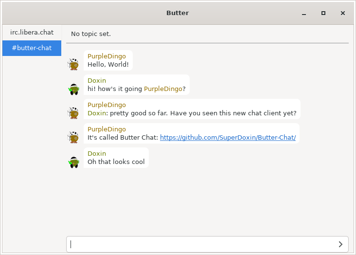

# Butter chat

Butter chat aims to be a modern IRC chat client with all the UI nicities
users have come to expect from a chat client.

It is currently in pre-alpha with most features required for actual use still
missing.

## Getting Started

These instructions will give you a copy of the project up and running on
your local machine for development and testing purposes. See deployment
for notes on deploying the project on a live system.

### Prerequisites

Requirements for the software and other tools to build, test and push
- [Python 3.9](https://www.python.org/)
- [Pre-commit](https://pre-commit.com/)
- Linux

### Installing

Install pre-commit globally

    pip install pre-commit

Clone the repository

    git clone git@github.com:SuperDoxin/Butter-Chat.git

Change into the repository folder

    cd Butter-Chat

Install pre-commit into the repository

    pre-commit install

Create a virtual environment

    python -m venv venv

Activate the virtual environment

    source venv/bin/activate

Install dependencies

    pip install -r requirements.txt

Run Butter chat

    python -m src

### Style test

Pre-commit automatically runs various hooks to ensure the correct code format.
The most important of these hooks are Black, which enforces the code formatting,
and Pylint, which complains a lot about various issues.

If Pre-commit finds a problem with the commit it will abort the commit. Some of
the hooks, like Black,  automatically fix the issues they find in which case you
only need to add these changes to the commit before trying again. Other hooks,
like Pylint, require you to manually fix the issues before adding them to the
commit and trying again.

## Contributing

Make sure all the pre-commit hooks pass before opening a pull request. Try
to make commits with messages that make sense.

## License

This project is licensed under the [AGPLv3](LICENSE.md) License - see the
[LICENSE.md](LICENSE.md) file for details.
